# CE Communication Engineering — Official Exam Scoring Key
### Module 01 & Module 02 | Master Questions M1.1 – M2.8

---

### M1.1 — Classify the electromagnetic frequency spectrum with frequency ranges, wavelength, and applications for each band. State the relationship c = fλ and explain how energy E = hf varies across the spectrum. **[10 Marks]**

#### 1. Fundamental Relations

$$c = f \lambda \quad \Rightarrow \quad \lambda = \frac{c}{f}$$

where $c = 3 \times 10^8 \text{ m/s}$, $f$ = frequency (Hz), $\lambda$ = wavelength (m).

$$E = hf$$

where $h = 6.626 \times 10^{-34}$ J·s (**Planck's constant**). Energy increases linearly with frequency — higher frequency = more energetic photons = greater ionizing potential.

---

#### 2. EM Spectrum Classification Table

| Band | Frequency Range | Wavelength | Propagation Mode | Key Applications |
|---|---|---|---|---|
| **VLF** (Very Low Freq) | 3–30 kHz | 10–100 km | Ground wave | Submarine comms, time signals |
| **LF** (Low Freq) | 30–300 kHz | 1–10 km | Ground wave | Navigation (NDB), AM longwave |
| **MF** (Medium Freq) | 300 kHz–3 MHz | 100 m–1 km | Ground + Sky wave | AM broadcast (530–1700 kHz) |
| **HF** (High Freq) | 3–30 MHz | 10–100 m | Sky wave (ionosphere) | Shortwave broadcast, HAM, aeronautical |
| **VHF** (Very High Freq) | 30–300 MHz | 1–10 m | Space wave (LOS) | FM broadcast (88–108 MHz), aviation VHF |
| **UHF** (Ultra High Freq) | 300 MHz–3 GHz | 10 cm–1 m | Space wave (LOS) | TV, 4G/5G cellular, GPS, Wi-Fi |
| **SHF** (Super High Freq) | 3–30 GHz | 1–10 cm | Directional beam | Satellite comms, radar, microwave links |
| **EHF** (Extremely High) | 30–300 GHz | 1–10 mm | Directional beam | 5G mmWave, radio astronomy |
| **Infrared** | 300 GHz–430 THz | 0.7 μm–1 mm | Optical | Fiber optics, remote sensing, IR remote |
| **Visible Light** | 430–750 THz | 400–700 nm | Optical | Li-Fi, optical fiber |
| **Ultraviolet** | 750 THz–30 PHz | 10–400 nm | Ionizing | Sterilization, fluorescence |
| **X-Rays** | 30 PHz–30 EHz | 0.01–10 nm | Ionizing | Medical imaging |
| **Gamma Rays** | > 30 EHz | < 0.01 nm | Ionizing | Nuclear medicine, cancer therapy |

---

#### 3. Energy Variation Across Spectrum

- **Low-frequency (Radio/Microwave):** $E$ is very small → **non-ionizing**, safe for communication.
- **High-frequency (UV/X-ray/Gamma):** $E$ is large → **ionizing**, can break chemical bonds.
- Example:
  - FM radio at 100 MHz: $E = hf = 6.626 \times 10^{-34} \times 10^8 = 6.6 \times 10^{-26}$ J (negligible)
  - X-ray at $10^{18}$ Hz: $E \approx 6.6 \times 10^{-16}$ J (ionizing)

---

#### 4. Diagram

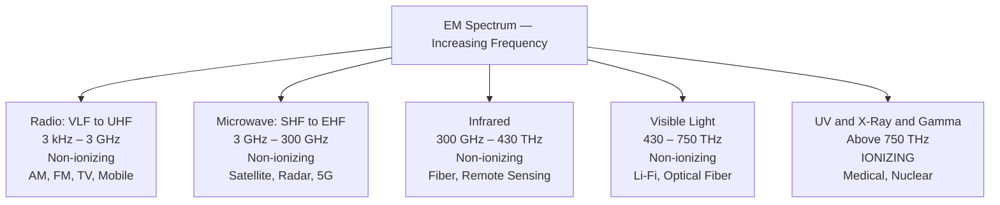

---

### M1.2 — Describe and differentiate ground wave, sky wave, and space wave propagation. **[5 Marks]**

#### 1. Ground Wave Propagation

- **Frequency band:** VLF, LF, MF (up to ~2 MHz)
- **Mechanism:** EM wave travels along the surface of the Earth, **guided by the conductivity of the ground**. The wave tilts forward due to diffraction around the Earth's curvature.
- **Range:** 100–500 km (depends on frequency and ground conductivity)
- **Attenuation:** Increases with frequency — **unusable above 2 MHz**
- **Applications:** AM broadcast (530–1700 kHz), maritime navigation, NDB beacons

#### 2. Sky Wave (Ionospheric) Propagation

- **Frequency band:** HF (3–30 MHz)
- **Mechanism:** Wave is **refracted (bent) by the ionospheric layers** (D, E, F1, F2) and returned to Earth. The F-layer (150–400 km altitude) is most important.
- **Skip distance:** Minimum range where sky wave first returns to Earth
- **Range:** 100–3000 km (single hop); multiple hops for global coverage
- **Limitations:** Fading, blackouts during solar storms, unreliable at night (D layer disappears)
- **Applications:** Shortwave broadcast, HAM radio, long-range HF military comms

#### 3. Space Wave (Line-of-Sight) Propagation

- **Frequency band:** VHF and above (>30 MHz)
- **Mechanism:** Wave travels in a **straight line** from transmitter to receiver. Ground reflection may cause multipath interference.
- **Range:** Limited to **radio horizon** $d = \sqrt{2hT} + \sqrt{2hR}$ (km), where $h$ = antenna height (m)
- **Applications:** FM broadcast, TV, cellular (4G/5G), satellite uplink, radar

#### 4. Comparison Table

| Parameter | Ground Wave | Sky Wave | Space Wave |
|---|---|---|---|
| Frequency | < 2 MHz | 3–30 MHz | > 30 MHz |
| Range | 100–500 km | 100–3000 km | Horizon-limited |
| Reliability | Very reliable | Variable (fading) | Reliable (LOS) |
| Antenna height | Low | Low | Important |

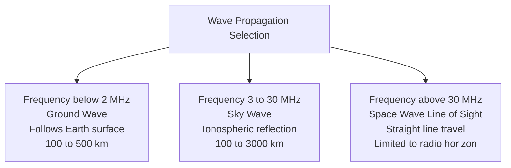

---

### M1.3 — Draw and explain the complete block diagram of a communication system. **[10 Marks]**

#### 1. Block Diagram

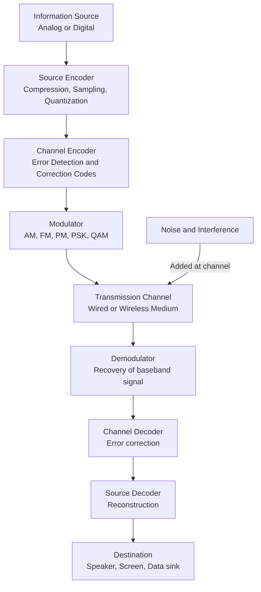

---

#### 2. Function of Each Block

| Block | Function |
|---|---|
| **Information Source** | Generates the message — voice, video, data. Analog (continuous) or digital (discrete). |
| **Source Encoder** | Removes redundancy. Compresses data (e.g., MP3, H.264). Converts analog to digital (ADC). |
| **Channel Encoder** | Adds **controlled redundancy** for error detection/correction (e.g., Hamming, CRC, convolutional). |
| **Modulator** | Impresses the baseband signal onto a **high-frequency carrier** for efficient transmission. |
| **Channel** | Physical medium — free space (wireless), coaxial cable, fiber, satellite link. |
| **Noise** | Unwanted additions — thermal, shot, atmospheric, interference. Corrupts the signal. |
| **Demodulator** | Extracts the baseband signal from the modulated carrier. Inverse of modulator. |
| **Channel Decoder** | Detects/corrects errors introduced in the channel using the added redundancy. |
| **Source Decoder** | Reconstructs original analog/digital information from compressed form. |
| **Destination** | End user or device receiving the information. |

---

#### 3. Need for Modulation — Three Core Reasons

1. **Antenna Size Reduction:**
   - Antenna length $\approx \lambda/4$. At audio frequency 3 kHz: $\lambda = c/f = 100$ km → impractical antenna.
   - At 1 MHz (AM carrier): $\lambda/4 = 75$ m → practical.
   - **Modulation shifts the signal to a high frequency where antenna is realizable.**

2. **Frequency Division Multiplexing (FDM):**
   - Multiple stations modulate different carrier frequencies → **coexist in the same medium** without interference.

3. **Noise Immunity:**
   - FM and PM offer significant SNR improvement over baseband transmission.
   - Modulation index determines noise performance.

---

### M1.4 — State Shannon-Hartley theorem. Explain bandwidth–power trade-off. Calculate channel capacity for B = 10 MHz, SNR = 20 dB. Compare bandwidth-limited vs power-limited systems. **[10 Marks]**

#### 1. Shannon-Hartley Theorem

$$C = B \log_2(1 + \text{SNR}) \quad \text{[bits/second]}$$

- $C$ = **channel capacity** (maximum error-free data rate, bits/s)
- $B$ = **bandwidth** (Hz)
- **SNR** = signal-to-noise power ratio (linear, not dB)

> This is a theoretical upper bound — no practical system can exceed $C$ with arbitrarily low error probability.

---

#### 2. Numerical Calculation

Given: $B = 10 \text{ MHz}$, $\text{SNR} = 20 \text{ dB}$

**Step 1 — Convert SNR from dB to linear:**
$$\text{SNR}_{\text{linear}} = 10^{20/10} = 10^2 = 100$$

**Step 2 — Apply Shannon:**
$$C = 10 \times 10^6 \times \log_2(1 + 100) = 10^7 \times \log_2(101)$$
$$\log_2(101) = \frac{\ln 101}{\ln 2} = \frac{4.615}{0.693} \approx 6.658$$

$$\boxed{C \approx 66.58 \text{ Mbps}}$$

---

#### 3. Bandwidth–Power Trade-off

The Shannon equation shows **two paths to increasing capacity:**

| Strategy | How | Example |
|---|---|---|
| **Increase B** | Use more spectrum | Wi-Fi 802.11ac: 80/160 MHz channels |
| **Increase SNR** | More transmit power or lower noise | High-power satellite uplink |

**Key trade-off insight:**
- Doubling bandwidth (SNR fixed) approximately doubles capacity.
- Doubling power (fixed $B$) adds only one additional bit per symbol at high SNR (logarithmic return).
- → **Bandwidth is more valuable than power at high SNR.**

---

#### 4. Bandwidth-Limited vs Power-Limited Systems

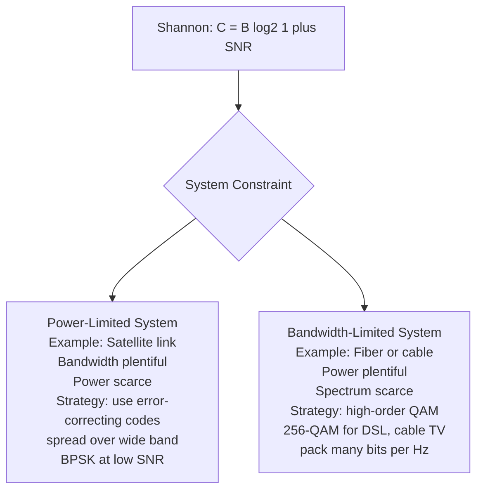

| System | Limiting Resource | Strategy | Modulation |
|---|---|---|---|
| **Satellite link** | Transmit power | Spread over wide band, use coding | BPSK, QPSK |
| **Optical fiber** | Bandwidth (DWDM channels) | High-order QAM | 256-QAM, 1024-QAM |
| **FM vs AM broadcast** | FM trades 20× more spectrum for noise immunity — a deliberate power-limited strategy |

---

### M1.5 — Define and classify noise. Write Pn = kTB. State significance of SNR. **[5 Marks]**

#### 1. Definition of Noise
**Noise** is any unwanted electrical signal that gets added to the desired signal, degrading information quality.

#### 2. Classification of Noise

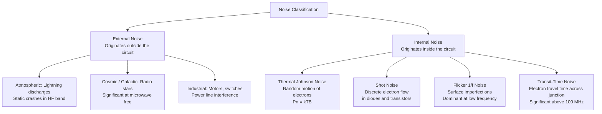

#### 3. Thermal Noise — Key Formula

$$P_n = kTB$$

| Symbol | Quantity | Value |
|---|---|---|
| $k$ | Boltzmann's constant | $1.38 \times 10^{-23}$ J/K |
| $T$ | Absolute temperature | 290 K (room temperature standard) |
| $B$ | Bandwidth | Hz |

At room temperature, noise power spectral density = $kT = 4 \times 10^{-21}$ W/Hz = **−174 dBm/Hz**

> **Thermal noise is white noise** — uniform PSD across all frequencies.

#### 4. Significance of SNR

$$\text{SNR} = \frac{P_{\text{signal}}}{P_{\text{noise}}} = \frac{P_s}{kTB}$$

In dB: $\text{SNR (dB)} = P_s\text{(dBm)} + 174 - 10\log_{10}B - \text{NF}$

- **High SNR** → signal dominates noise → high-quality, low-error communication.
- **Low SNR** → signal buried in noise → distortion, bit errors.
- Minimum usable SNR: ~10 dB for analog voice; ~3–6 dB with error-correcting codes.

---

### M1.6 — Define noise factor F, NF, equivalent noise temperature. Apply Friis formula. Calculate NF. Explain LNA requirement. **[10 Marks]**

#### 1. Noise Factor (F) — Definition

$$F = \frac{\text{SNR}_{\text{in}}}{\text{SNR}_{\text{out}}} \geq 1$$

> $F = 1$ for an **ideal noiseless** device. Every real device adds noise, so $F > 1$.

**Noise Figure (NF):**
$$\text{NF} = 10 \log_{10}(F) \quad \text{[dB]}$$

Ideal device: NF = 0 dB. Typical LNA: NF = 1–3 dB. Typical mixer: NF = 6–10 dB.

---

#### 2. Numerical: Calculate NF

Given: $\text{SNR}_{\text{in}} = 25\text{ dB}$, $\text{SNR}_{\text{out}} = 22\text{ dB}$

$$\text{NF} = \text{SNR}_{\text{in}}(\text{dB}) - \text{SNR}_{\text{out}}(\text{dB}) = 25 - 22 = \boxed{3 \text{ dB}}$$

In linear: $F = 10^{3/10} = 1.995 \approx 2$

---

#### 3. Equivalent Noise Temperature (Te)

$$T_e = (F - 1) \cdot T_0 \quad \text{where } T_0 = 290 \text{ K}$$

- Represents the temperature of a **fictitious noise source at the input** that would produce the same added noise.
- Preferred for **satellite and radio astronomy** systems where noise is specified in Kelvin.
- Example: NF = 3 dB → $F = 2$ → $T_e = (2-1) \times 290 = 290$ K

---

#### 4. Friis Noise Formula — Cascaded Stages

$$F_{\text{total}} = F_1 + \frac{F_2 - 1}{G_1} + \frac{F_3 - 1}{G_1 G_2} + \cdots$$

In dB form: $\text{NF}_{\text{total}} \approx \text{NF}_1$ when $G_1$ is large.

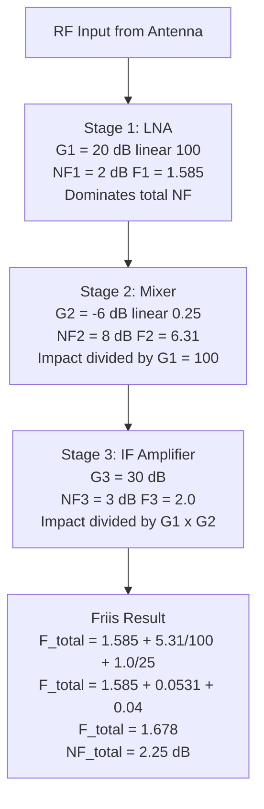

**Worked calculation:**
$$F_{\text{total}} = 1.585 + \frac{6.31 - 1}{100} + \frac{2.0 - 1}{100 \times 0.25} = 1.585 + 0.053 + 0.04 = 1.678$$
$$\text{NF}_{\text{total}} = 10\log_{10}(1.678) = \boxed{2.25 \text{ dB}}$$

---

#### 5. Why the LNA Must Have Low NF and High Gain

- From Friis: the **first stage noise figure ($F_1$) appears directly** in the total without any division.
- Every subsequent stage's noise contribution is **divided by all preceding gains**.
- **High $G_1$** suppresses the noise contribution of all following stages exponentially.
- **Low $\text{NF}_1$** minimizes the unavoidable first-stage noise floor.
- → **LNA design rule: Maximize $G_1$, minimize $\text{NF}_1$.** Typical LNA: NF = 1–2 dB, Gain = 15–25 dB.

---

## MODULE 02 — Amplitude Modulation

---

### M2.1 — Define AM. Derive P_T = Pc(1 + m²/2). Calculate for Pc = 40 kW, m = 0.8. Explain 33.33% efficiency cap. **[10 Marks]**

#### 1. Definition of Amplitude Modulation

**AM** is a modulation technique in which the **amplitude of the carrier signal is varied proportionally to the instantaneous value of the message signal**, while frequency and phase remain constant.

**Mathematical expression:**
$$s(t) = A_c[1 + m \cdot \cos(\omega_m t)] \cdot \cos(\omega_c t)$$

| Symbol | Meaning |
|---|---|
| $A_c$ | Carrier amplitude (V) |
| $\omega_c = 2\pi f_c$ | Carrier angular frequency |
| $\omega_m = 2\pi f_m$ | Message angular frequency |
| $m = A_m / A_c$ | **Modulation index** (0 ≤ m ≤ 1) |

---

#### 2. Power Derivation

**Expand the AM signal:**
$$s(t) = A_c\cos(\omega_c t) + \frac{mA_c}{2}\cos[(\omega_c + \omega_m)t] + \frac{mA_c}{2}\cos[(\omega_c - \omega_m)t]$$

Three components: **carrier**, **USB**, **LSB**.

**Carrier power** (across load $R$):
$$P_c = \frac{A_c^2}{2R}$$

**Power in each sideband (USB = LSB):**
$$P_{\text{USB}} = P_{\text{LSB}} = \frac{(mA_c/2)^2}{2R} = \frac{m^2 A_c^2}{8R} = \frac{m^2 P_c}{4}$$

**Total power:**
$$P_T = P_c + P_{\text{USB}} + P_{\text{LSB}} = P_c + \frac{m^2 P_c}{4} + \frac{m^2 P_c}{4}$$

$$\boxed{P_T = P_c\left(1 + \frac{m^2}{2}\right)}$$

---

#### 3. Numerical Calculation — Pc = 40 kW, m = 0.8

**(a) Total transmitted power:**
$$P_T = 40\left(1 + \frac{0.64}{2}\right) = 40 \times 1.32 = \boxed{52.8 \text{ kW}}$$

**(b) Power per sideband:**
$$P_{\text{USB}} = P_{\text{LSB}} = \frac{m^2 P_c}{4} = \frac{0.64 \times 40}{4} = \boxed{6.4 \text{ kW each}}$$

**(c) Power efficiency (fraction in sidebands):**
$$\eta = \frac{m^2/2}{1 + m^2/2} = \frac{0.32}{1.32} = 0.2424 = \boxed{24.2\%}$$

**(d) % increase in total power when m → 1:**
$$P_T|_{m=1} = 40 \times 1.5 = 60 \text{ kW}$$
$$\% \text{ increase} = \frac{60 - 52.8}{52.8} \times 100 = \boxed{13.6\%}$$

---

#### 4. Why Efficiency is Capped at 33.33%

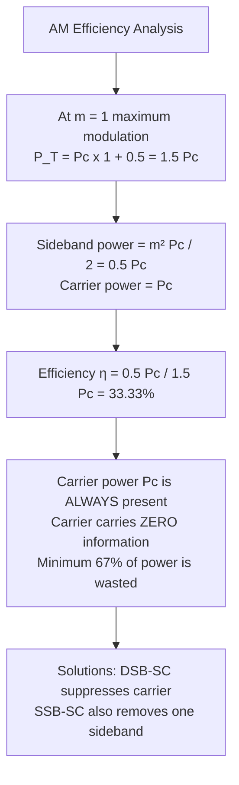

- Even at **100% modulation (m = 1)**, the carrier consumes $P_c$ out of $1.5P_c$ total.
- **The carrier contains no information.** It only enables simple envelope detection.
- At $m < 1$: efficiency is even lower.
- At $m = 1$: $\eta_{\max} = \frac{m^2/2}{1+m^2/2} = \frac{0.5}{1.5} = \mathbf{33.33\%}$

---

### M2.2 — Explain current distribution. Derive I_T = Ic·√(1 + m²/2). Calculate for Pc = 500 W, R = 50 Ω. Explain modulation depth effects. **[10 Marks]**

#### 1. Current Distribution in AM Antenna

An AM transmitter feeds its output power to a **resistive antenna**. The antenna current varies with modulation because total transmitted power changes with modulation index.

Since $P = I^2 R$:

$$P_c = I_c^2 R \quad \Rightarrow \quad P_T = I_T^2 R$$

Dividing:
$$\frac{P_T}{P_c} = \frac{I_T^2}{I_c^2} = 1 + \frac{m^2}{2}$$

$$\boxed{I_T = I_c\sqrt{1 + \frac{m^2}{2}}}$$

> This formula is the basis of **modulation monitoring** — measuring antenna current change reveals modulation depth.

---

#### 2. Numerical Calculation — Pc = 500 W, R = 50 Ω

**Unmodulated (carrier) current:**
$$I_c = \sqrt{\frac{P_c}{R}} = \sqrt{\frac{500}{50}} = \sqrt{10} = \boxed{3.162 \text{ A}}$$

| Modulation Index $m$ | Formula | $I_T$ (A) |
|---|---|---|
| $m = 0$ | $I_T = I_c\sqrt{1+0} = I_c$ | **3.162 A** |
| $m = 0.5$ | $I_T = I_c\sqrt{1+0.125} = 1.061 I_c$ | **3.355 A** |
| $m = 1.0$ | $I_T = I_c\sqrt{1+0.5} = 1.225 I_c$ | **3.873 A** |

---

#### 3. Modulation Depth Effects

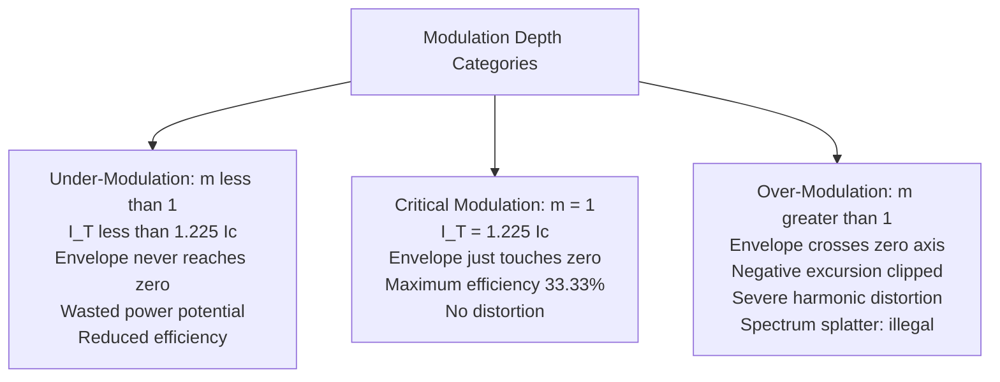

**Consequences of over-modulation:**
- **Envelope distortion:** Envelope detector output is clipped → audio distortion.
- **Harmonic generation:** Non-linear clipping produces harmonics extending well beyond allocated channel bandwidth.
- **Adjacent-channel interference:** Illegal — violates regulatory spectral mask.
- **Carrier component with phase reversal:** DC component of envelope goes negative → detection fails.

---

### M2.3 — Explain and compare AM modulator types. Compare low-level vs high-level modulation. **[10 Marks]**

#### 1. Types of AM Modulators

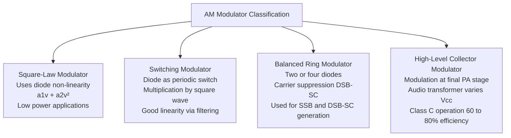

---

#### 2. Square-Law Modulator — Working Principle

A **non-linear device** (diode or transistor biased in quadratic region) has the input-output characteristic:

$$v_{\text{out}} = a_1 v_{\text{in}} + a_2 v_{\text{in}}^2$$

Apply $v_{\text{in}} = V_c\cos\omega_c t + V_m\cos\omega_m t$:

$$v_{\text{out}} = a_1(V_c\cos\omega_c t + V_m\cos\omega_m t) + a_2(V_c\cos\omega_c t + V_m\cos\omega_m t)^2$$

After expansion, bandpass filter selects terms around $\omega_c$:

$$v_{\text{AM}} = a_1 V_c\left(1 + \frac{a_2 V_m}{a_1}\cos\omega_m t\right)\cos\omega_c t$$

**Modulation index:** $m = \frac{a_2 V_m}{a_1}$

**Limitation:** Higher-order terms cause distortion (Total Harmonic Distortion, THD).

---

#### 3. Balanced Modulator — DSB-SC Generation

- Two matched diodes (or transistors) in **bridge configuration**.
- Carrier applied to both in phase; message applied differentially.
- **Carrier components cancel** in the output transformer → only sidebands remain → **DSB-SC**.
- Requires: matched diodes, careful transformer design for maximum carrier suppression (>40 dB typically).

---

#### 4. Low-Level vs High-Level Modulation

| Parameter | Low-Level Modulation | High-Level (Collector) Modulation |
|---|---|---|
| **Modulation point** | Early stage (pre-PA) | Final PA stage |
| **RF stages after modulator** | Must be **linear** (Class A/AB) | Not required (Class C allowed) |
| **Efficiency** | 25–35% (limited by linear PA) | **60–80%** (Class C PA) |
| **Modulation transformer** | Small, low power | Large, must handle full audio power |
| **Distortion** | Lower (linear stages) | Slightly higher |
| **Application** | Low-power transmitters, mobile | **High-power broadcast transmitters** |
| **Cost** | Lower | Higher (large transformer) |

**Class C PA suitability (high-level):**
- Class C conducts for $< 180°$ of each RF cycle → very high efficiency.
- The modulation transformer varies the collector supply voltage ($V_{cc}$) in step with the audio signal.
- The **tuned output tank circuit reconstructs** the full AM waveform from the pulse train.

---

### M2.4 — Explain balanced modulator and envelope detector. State RC condition. Describe AGC voltage generation. **[10 Marks]**

#### 1. Balanced Modulator — DSB-SC Generation

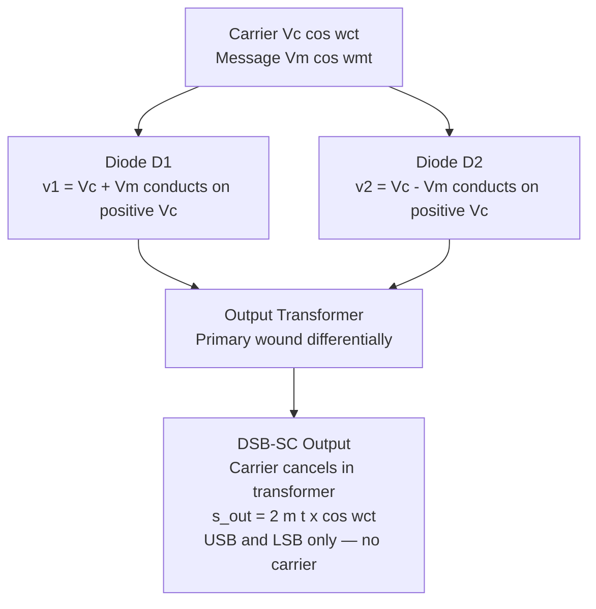

**Mathematical derivation:**
- $D_1$ conducts: output $\propto (V_c + V_m)\cos\omega_c t$
- $D_2$ conducts: output $\propto (V_c - V_m)\cos\omega_c t$
- Transformer subtracts: $\propto 2V_m\cos\omega_m t \cdot \cos\omega_c t$
- Product expansion: $\propto V_m[\cos(\omega_c+\omega_m)t + \cos(\omega_c-\omega_m)t]$
- **Result: Only USB and LSB, carrier component = 0**

---

#### 2. Envelope Detector — Working Principle

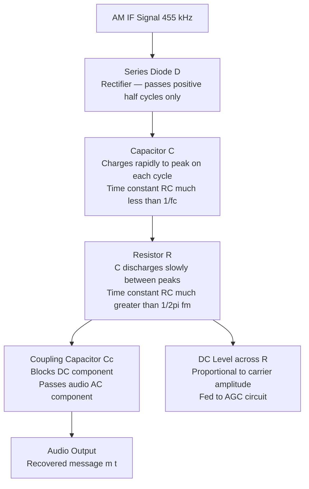

#### 3. RC Time-Constant Condition

The capacitor must:
- **Charge fast enough** to follow RF peaks: $RC \ll \frac{1}{f_c}$
- **Discharge slow enough** to follow audio envelope: $RC \gg \frac{1}{2\pi f_m}$

$$\frac{1}{f_c} \ll RC \ll \frac{1}{2\pi f_m}$$

**Numerical values for $f_c = 455$ kHz, $f_m = 5$ kHz:**

$$\frac{1}{455 \times 10^3} = 2.2 \text{ μs} \ll RC \ll \frac{1}{2\pi \times 5000} = 31.8 \text{ μs}$$

**Practical design:** $R = 10 \text{ k}\Omega$, $C = 1 \text{ nF}$ → $RC = 10 \text{ μs}$ ✓

---

#### 4. AGC Voltage Generation

- The **DC component across $R$** is directly proportional to the **average carrier amplitude**.
- This DC level is extracted via a **long time-constant RC filter** ($\tau \approx 0.1$–$0.5$ s) that removes the audio variation but retains slow carrier-strength changes.
- The filtered DC voltage is applied to the **bias of the RF and IF amplifier transistors**, inversely controlling their transconductance and hence gain.
- **Strong signal → higher DC → reduced transistor gain → output remains constant.**
- **Weak signal → lower DC → maximum transistor gain → sensitivity maintained.**

---

### M2.5 — Classify all AM variants. Compare DSB-FC, DSB-SC, SSB-SC, and VSB. **[10 Marks]**

#### 1. Classification Diagram

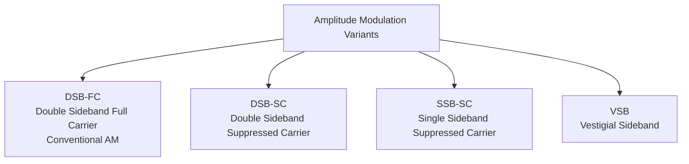

---

#### 2. Comprehensive Comparison Table

| Parameter | **DSB-FC** | **DSB-SC** | **SSB-SC** | **VSB** |
|---|---|---|---|---|
| **Mathematical form** | $A_c[1+m\cos\omega_m t]\cos\omega_c t$ | $m(t)\cos\omega_c t$ | Upper or lower sideband only | Full USB + partial LSB |
| **Carrier transmitted?** | Yes — full power | No — suppressed | No — suppressed | No — suppressed |
| **Bandwidth** | $2f_m$ | $2f_m$ | $f_m$ | $f_m +$ vestige (slightly > $f_m$) |
| **Power efficiency** | ≤ 33.33% at m=1 | **100%** (all power in sidebands) | **100%** | ~100% |
| **Detection method** | **Envelope detector** (simple diode+RC) | **Coherent/synchronous** (carrier recovery needed) | **Coherent** | **Envelope** (vestige restores symmetry) |
| **Carrier recovery** | Not needed | Required — Costas loop or PLL | Required | Not needed |
| **Complexity** | Low | Medium | **High** (sharp SSB filter required) | Medium |
| **Applications** | AM broadcast, aviation VHF | Data links, experimental | HF voice (SSB radio), military | **TV video**, cable TV (DVB-C) |
| **Bandwidth (broadcast)** | 10 kHz (5 kHz audio) | 10 kHz | 5 kHz | 4.95 MHz (TV: 4.2 MHz + 0.75 MHz vestige) |
| **Key advantage** | Simple receiver — legacy compatible | All power useful | Half bandwidth of DSB | Compromise: simpler than SSB, less BW than DSB |
| **Key disadvantage** | 67% power wasted in carrier | Cannot use envelope detector | Complex filter to eliminate one sideband | Non-ideal filter — vestige causes small distortion |

---

#### 3. Spectral Diagrams (Described)

- **DSB-FC spectrum:** Three lines at $f_c - f_m$, $f_c$, $f_c + f_m$. Carrier is tallest.
- **DSB-SC spectrum:** Two lines at $f_c \pm f_m$. No line at $f_c$.
- **SSB-USB spectrum:** Single line at $f_c + f_m$ (or band from $f_c$ to $f_c + B$ for multi-tone).
- **VSB spectrum:** Full upper sideband + attenuated lower sideband vestige near $f_c$.

---

### M2.6 — Explain VSB in detail: compromise, Nyquist filter, bandwidth calculation, envelope detection. **[10 Marks]**

#### 1. Why VSB is a Compromise

| | DSB | SSB | **VSB** |
|---|---|---|---|
| **Bandwidth** | $2f_m$ (wasteful) | $f_m$ (minimum) | $f_m + \epsilon$ (slightly more than SSB) |
| **Low-frequency fidelity** | Excellent | **Poor — sharp filter cannot pass DC/near-DC** | **Good — vestige preserves low-freq content** |
| **Filter complexity** | Simple | **Very complex** (ideal brick-wall filter) | **Moderate** (gradual Nyquist slope) |
| **Detection** | Envelope (easy) | Coherent required | **Envelope (easy)** |

> **VSB solves SSB's critical problem:** SSB requires a theoretically impossible brick-wall filter at $f_c$. For video signals (which have significant energy near DC and 0 Hz sync pulses), this is unacceptable. VSB retains a "vestige" (remnant) of one sideband to preserve low-frequency fidelity.

---

#### 2. Role of the Nyquist Slope Filter

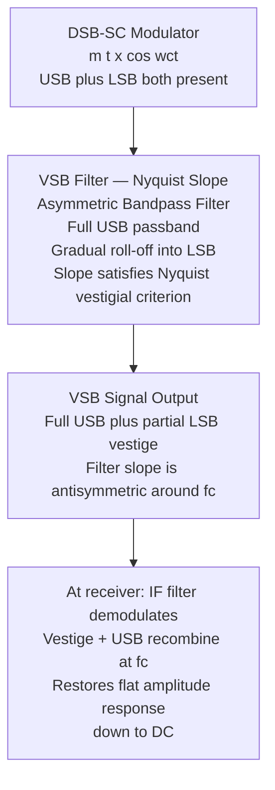

**Nyquist Vestigial Criterion:**
$$H_{\text{VSB}}(f + f_c) + H_{\text{VSB}}(f - f_c) = \text{constant} \quad \text{for } |f| \leq B$$

The filter's slope is **antisymmetric about** $f_c$ so that the sum of upper and lower sideband contributions is constant across all baseband frequencies → flat demodulated response.

---

#### 3. Bandwidth Calculation — TV Example

- Baseband video signal: 0–**4.2 MHz** (luminance + sync)
- Full DSB would require: $2 \times 4.2 = 8.4$ MHz
- VSB standard (NTSC): Full USB (4.2 MHz) + vestige of LSB (0.75 MHz)
$$\text{BW}_{\text{VSB}} = 4.2 + 0.75 = \boxed{4.95 \text{ MHz}}$$
- Saving vs DSB: $8.4 - 4.95 = 3.45$ MHz per channel → allows 2× more channels in the same spectrum.

---

#### 4. Why Envelope Detection Works in VSB but NOT in SSB

**SSB — Envelope detection fails:**
- SSB signal has the form: $s_{\text{SSB}}(t) = A_c[\cos(\omega_c+\omega_m)t]$
- The envelope is **constant** — it does not vary with the message.
- Envelope detector output = constant → **no audio recovered**.
- SSB requires **coherent detection** with a locally regenerated carrier.

**VSB — Envelope detection works:**
- The vestige of the second sideband **restores amplitude symmetry** around $f_c$.
- The combined USB + vestige creates an envelope that **varies with the message signal**.
- For small vestige widths, near-linear envelope detection is achievable with minimal distortion.
- The IF filter's Nyquist slope ensures the recombined signal has the correct amplitude across all audio frequencies.

---

### M2.7 — Define AGC. Explain AGC loop. Compare Simple, Delayed, Forward AGC. State time constant. **[5 Marks]**

#### 1. Definition of AGC

**Automatic Gain Control (AGC)** is a **negative feedback system** that automatically adjusts the gain of the RF and IF amplifiers **inversely proportional to received signal strength**, maintaining a nearly constant audio output level regardless of signal variations.

**Purpose:** Received signal strength varies over a range of 100 dB (from microvolts for distant stations to millivolts for nearby transmitters). Without AGC: weak signals are inaudible, strong signals saturate the output.

---

#### 2. AGC Loop — Working Principle

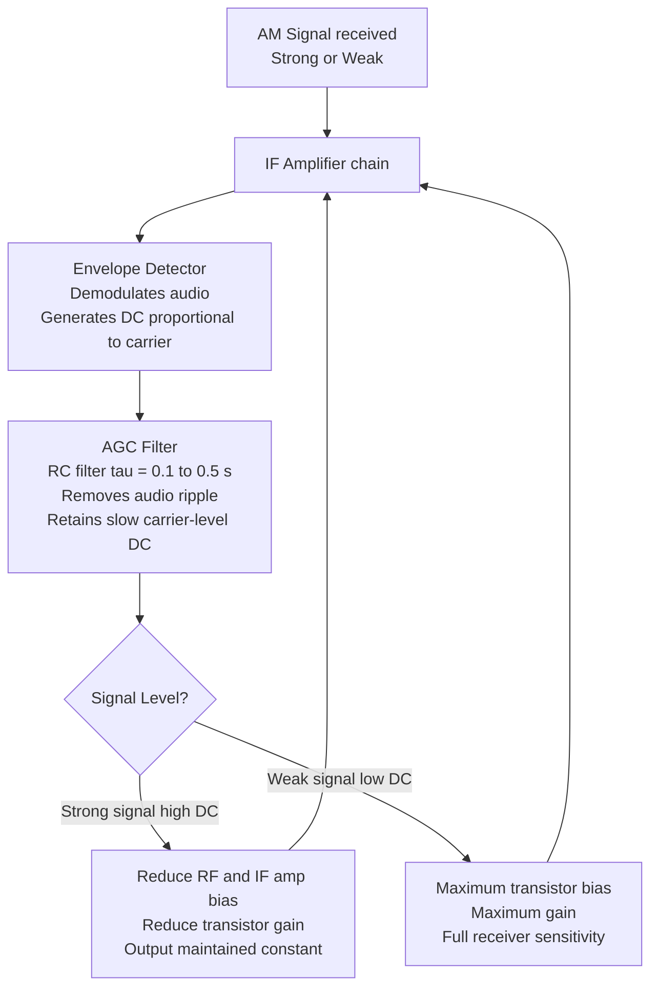

**AGC time constant requirement:**
$$\tau = RC \gg \frac{1}{f_{m,\min}} \quad \text{(must not respond to audio)}$$
$$\tau \approx 0.1 \text{ to } 0.5 \text{ s} \quad \text{(fast enough to follow propagation fading)}$$

---

#### 3. Types of AGC

| Type | Description | Characteristic | Application |
|---|---|---|---|
| **Simple AGC** | AGC acts for all signal levels; no threshold | Gain reduced even for weak signals → SNR degraded for weak inputs | Low-cost AM radios |
| **Delayed AGC** | AGC only activates above a **threshold voltage** set by a bias diode. Below threshold: full gain | Preserves maximum sensitivity for weak signals; AGC only compresses strong signals | Broadcast receivers, communication receivers |
| **Forward AGC** | Increases collector current ($I_C$) to push transistor into lower-gain region (rather than reducing bias) | **Faster response**, wider dynamic range, easily integrated in ICs | Modern chip-based receivers (TA7642, etc.) |

> **Best for weak-signal performance:** Delayed AGC — full gain until signal exceeds threshold.

---

### M2.8 — Describe AM applications: broadcast, aviation, emergency, navigation. Explain capture effect and graceful degradation. **[10 Marks]**

#### 1. AM Broadcast Radio (530–1700 kHz, MF Band)

- **Propagation mode:** Ground wave during day (range ~150 km), sky wave at night (range >1000 km).
- **Channel spacing:** 10 kHz in Americas, 9 kHz in Europe.
- **Why AM (not FM):** Ground wave propagation covers vast rural areas without line-of-sight. FM (VHF) requires LOS and has limited range (~60 km from transmitter).
- **Power levels:** 250 W (local) to 500 kW (international shortwave stations).

---

#### 2. Aviation VHF Communication (118–136 MHz)

- **Why AM not FM?** The **capture effect** in FM is dangerous in aviation:
  - FM **captures** (completely suppresses) the weaker of two co-channel signals.
  - If two aircraft transmit simultaneously on the same ATC frequency: in FM, only the stronger aircraft is heard — the weaker (potentially in distress) is silenced.
  - In **AM**: both transmissions are heard simultaneously (mixed) — pilots can distinguish multiple voices.
- **Channel spacing:** 25 kHz (standard), 8.33 kHz (European high-density).

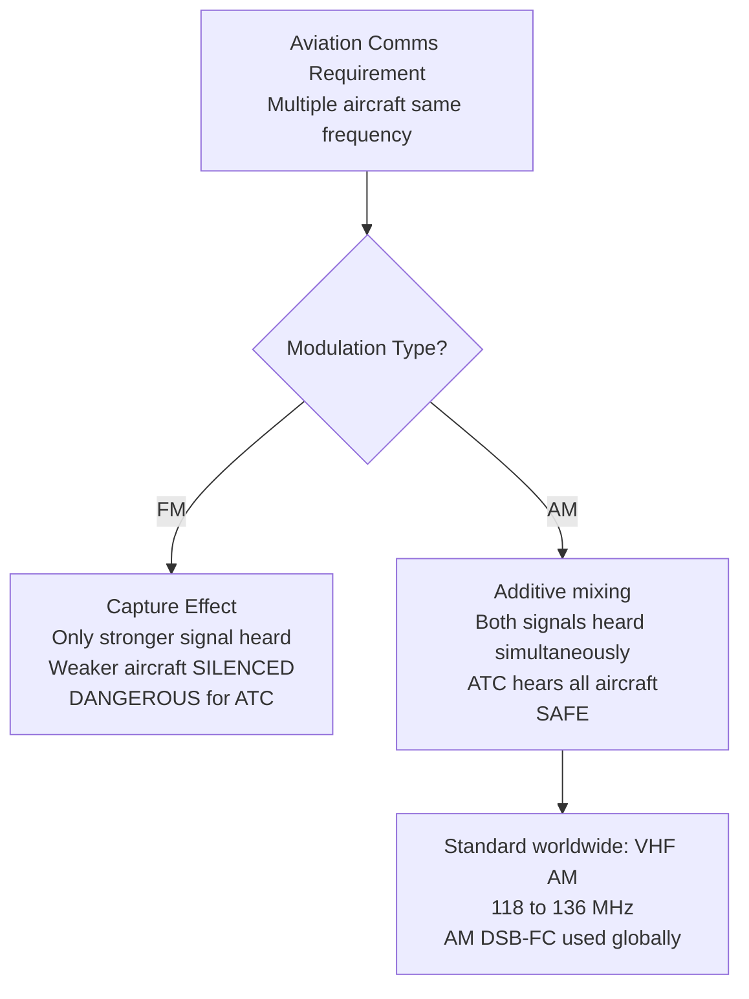

---

#### 3. Emergency Communication Systems

- **AM graceful degradation** vs **FM threshold collapse:**

| SNR Condition | AM Performance | FM Performance |
|---|---|---|
| SNR > 20 dB | Clean, clear audio | Clean, clear audio |
| SNR = 10 dB | Slightly noisy but **intelligible** | Clean (above FM threshold) |
| SNR = 8 dB | Noticeably noisy, still **usable** | FM begins to collapse |
| SNR = 5 dB | Degraded but **words understood** | FM output **collapses** — unintelligible noise burst |

- In disasters, fringe-area emergency broadcasts remain intelligible on AM even with severely degraded signal.
- **AM is mandatory for certain emergency broadcast services** for this reason.

---

#### 4. Navigation — NDB (Non-Directional Beacons)

- Operate in **LF/MF band (190–1750 kHz)**.
- Ground wave covers circular area around beacon.
- Aircraft ADF (Automatic Direction Finder) measures direction to beacon.
- AM carrier modulated with 1020 Hz tone and Morse code identifier.
- Still operational worldwide as backup to GPS.

---

#### 5. Summary — Why AM Persists

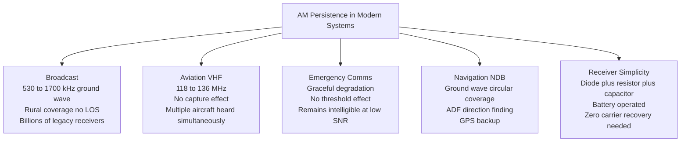
